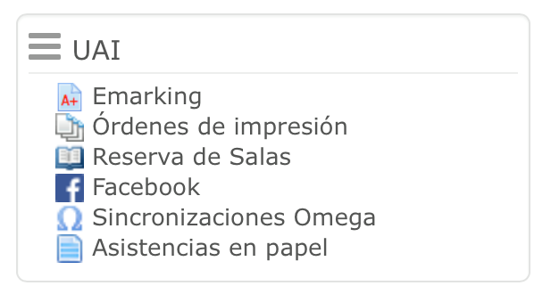

# block_uai

UAI Block for Moodle 3.1 & 3.2

Version: 2.0.0

------------------------------------------

Authors:
* Mark Michaelsen (mmichaelsen678@gmail.com)
* Hans Jeria (hansjeria@gmail.com)

Release notes
-------------

2.0.0: Block remade completely for Moodle versions 3.1 & 3.2

1.0.0: First official deploy

Compatibility
-------------

This block has been remade for Moodle versions 3.1 & 3.2 and may not work properly for other versions.
It has been tested for version 3.0+ but we recommend using that version's way to constructing blocks.

Introduction
------------

This block has been in use for a long time and hadn't had any problems so far. However, UAI's Moodle site (WebCursos) is constantly updated and it stopped working for version 3.1 and further.
It contains the main functions needed for Adolfo Ibáñez University (a.k.a. UAI), such as booking study rooms, eMarking, Facebook connection, PaperAttendance, etc. This is why it was so important to keep it up to date for the newer Moodle platforms as these services can't stop working.
The new version of block UAI includes a completely new & custom way of rendering, defined as a collapsible list instead of a node tree. It also has new custom icons for each plugin, making it more fluid and easy to use.

Installation
------------

To install block UAI, follow the regular block installation instructions:
* Copy this repository inside the directory /blocks/ of your Moodle installation and name it 'uai'.
* Visit your page as an administrator in order to start the installation prompt and continue.
* When the installation completes, a settings window will show up with a list of local modules from UAI's services. Select the ones that are already installed or the block may show undesired warnings. Custom icons are also set here.
* After completing the installation, it's time for the block to show up in your page. In your site home, enable editing, search for 'Add a block' and select UAI.
* When the block shows up, go to the block's configuration and set it to appear in every page of your site, preferably at the top of the page.
* Don't forget to disable editing when finished.

The block is now ready! Most of the functions included in it require capabilities, so some user will not be able to see all of them. If you happen to see something not working, consider checking if the plugins are up to date or installed at all.
In case you didn't have a plugin at the time the block was installed but want to install it later, you can edit the settings of the block at the plugins overview in Site Administration after installing the plugin. Enabling/disabling custom icons can also be changed there.

Acnkowledgments, suggestions, complaints and bug reporting
----------------------------------------------------------

If you want to share any feedback with us, please contact us to any of the authors listed at the top of this document. We'll be glad to hear suggestions, complaints and/or bug reports, and will answer as soon as possible.